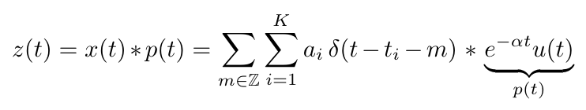

# spikeFRInder: Spike inference algorithm using frequency-domain FRI framework

This repository contains the code for the methods for estimating spikes in a stream of decaying exponentials.

### Basic Decaying Exponential Model

The model assumes the input signal to come from a stream of dirac delta functions convolved with a causal decaying exponential. Thus, the signal in continuous-time is of the form



The continuous-time signal is then corrupted with noise and sampled to create the input to the method. The method estimates the amplitudes and locations of the delta functions.

Estimating spike times and amplitudes from a signal can be done with the following code:

```python
from spikeFRInder import estimate_tk_ak
output = estimate_tk_ak(signal, Fs, K, alpha_grid_ends)
```

The code includes descriptions of all parameters.

### Application to Calcium Imaging Spike Inference

An application of this is in spike inference with calcium imaging signals. This can be achieved with the following code.

```python
from spikeFRInder import sliding_window_predict
sliding_window_predict(signal, Fs, K_full_signal_estimate)
```

The code includes descriptions of all parameters, including optional arguments which should be optimized. An example using a synthetic calcium signal can be found in `example.ipynb`.
