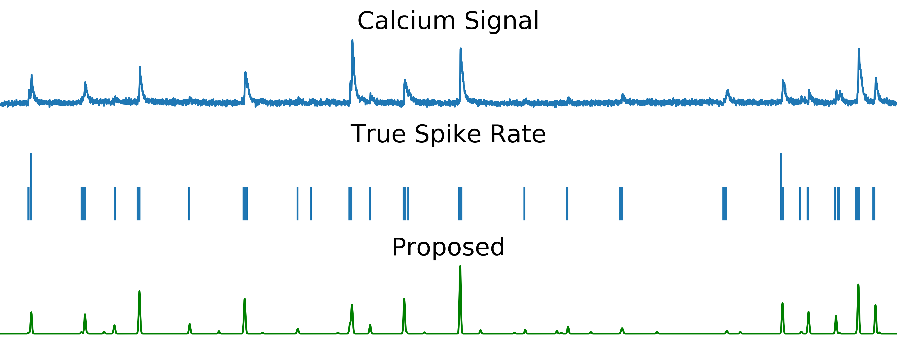

# spikeFRInder: Spike inference algorithm using frequency-domain FRI framework

This repository contains the code for the methods for estimating spikes in a stream of decaying exponentials, which is described in the upcoming paper **A finite rate of innovation approach for the estimation of a stream of decaying exponentials** in the ASILOMAR Conference on Signals, Systems, and Computers (2020).

### Basic decaying exponential model

The model assumes the input signal to come from a stream of dirac delta functions convolved with a causal decaying exponential. Thus, the signal in continuous-time is of the form


The continuous-time signal is then corrupted with noise and sampled to create the input to the method. The method estimates the amplitudes and locations of the delta functions.

Estimating spike times and amplitudes from a signal can be done with the following code:

```python
from spikeFRInder import estimate_tk_ak
output = estimate_tk_ak(signal, Fs, K, alpha_grid_ends)
tk_indices = output['tk_indices']
ak_hat = output['ak_hat']
```

The code includes descriptions of all parameters.

### Application to calcium imaging spike inference

An application of this is in spike inference with calcium imaging signals. This can be achieved with the following code.

```python
from spikeFRInder import sliding_window_predict
smoothed_estimate_histogram = sliding_window_predict(signal, Fs, K_full_signal_estimate)
```

The code includes descriptions of all parameters, including optional arguments which should be optimized. The smoothed estimate histogram can be thresholded to obtain more exact spike location estimates. 

An example using a synthetic calcium signal can be found in `example.ipynb`.

The following figure demonstrates a thresholded output from a real calcium imaging trace.



### Script to recreate paper figure

The script `crossval.py` was used to generate Fig. 3 in the paper. However, we do not own the data, which must be downloaded using a CRCNS.org account, so it is not included here.

### Preprocessing code

The calcium signal preprocessing was done with a slightly modified version of the preprocessing done by  [Theis et al. Benchmarking spike rate inference in population calcium imaging](http://bethgelab.org/publications/127/). Thus, the code in `c2s_preprocess_modified.py` comes from [their provided code](https://github.com/lucastheis/c2s), with only a minor change in the method of robust linear regression. 

